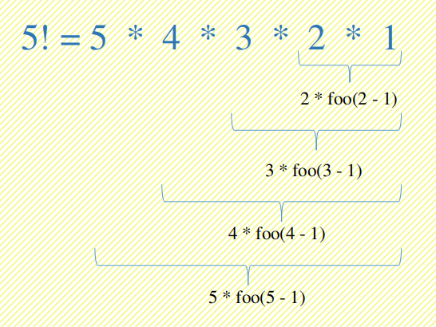

========
递归算法
========

递归的思想是把一个大问题逐部拆分成一个相似小问题. 拿最常举例的阶乘计算来说,计算 5 的阶乘.

.. code:: c

    #define <stdio.h>
    
    int recursion(int n) {
        if (n == 1) {
            return 1;
        }
        return n * recursion(n - 1);
    }

    int main()
    {
        int total = recursion(5); // factorial of 5
        printf("factorial of 5 is %d\n", total);
        return 0;
    }

对于阶乘的计算可以利用函数的递归来实现,但是函数嵌套越深对程序栈的消耗就越大,所以对于如果有深的函数嵌套的情况,递归实现就不合适.
