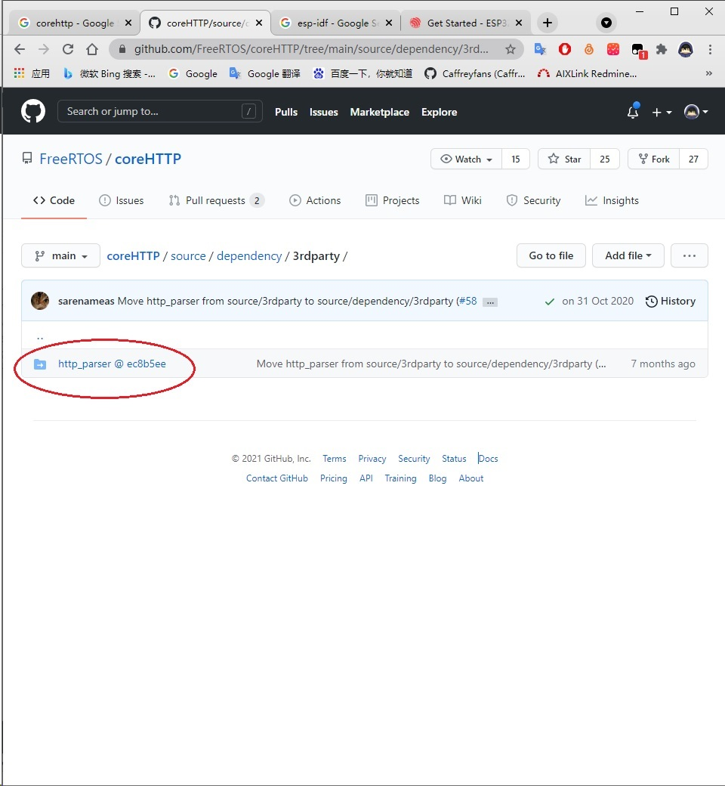
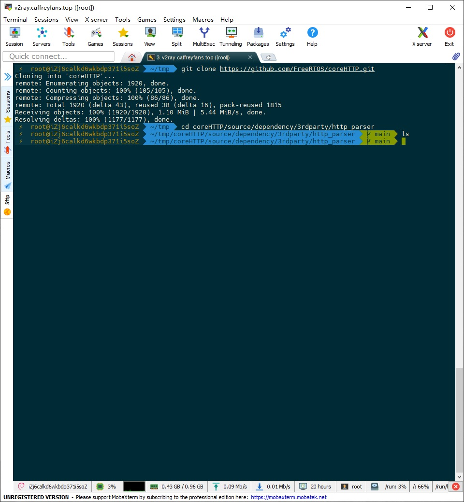
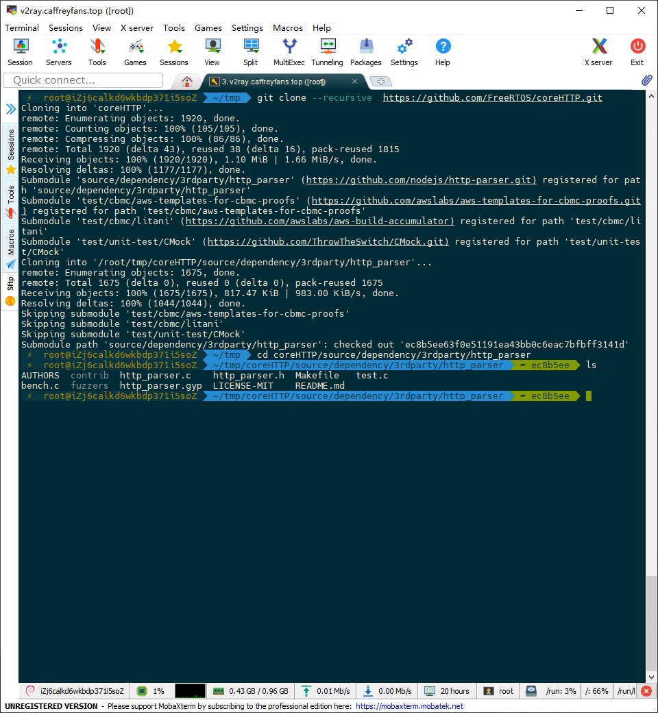

Git 使用比较有用的知识点
=========================

递归克隆
----------

不知道你遇到过这种情况没有，一个仓库里还引用了另一个仓库，比如这种。

这时候我们直接克隆会怎么样

.. code:: bash

    git clone https://github.com/FreeRTOS/coreHTTP.git

克隆下载后发现引用的仓库并没有克隆下来，编译也依赖这个仓库里面的文件的话，我们编译肯定是不能通过的。

所以我们需要把引用的仓库也克隆下来，需要加的参数就是 ``--recursive``，现在看看加了参数的效果。

可以看到使用递归克隆后，引用的仓库也会被克隆下来，如果是引用仓库里面也有引用的话也一样。这样我们就能完全拉取我们所需要的所有资源。

远程分支覆盖本地分支
--------------------

这种情况一般是我们本地的代码改乱了，或者是本地分支跟远程分支冲突太大以至于不得不得放弃本地修改。这时候就可以用远程分支直接覆盖本地分支。

.. code:: bash

    git fetch -all  # 拉取所有分支
    get reset --hard origin/master # master 为你想同步的分支名