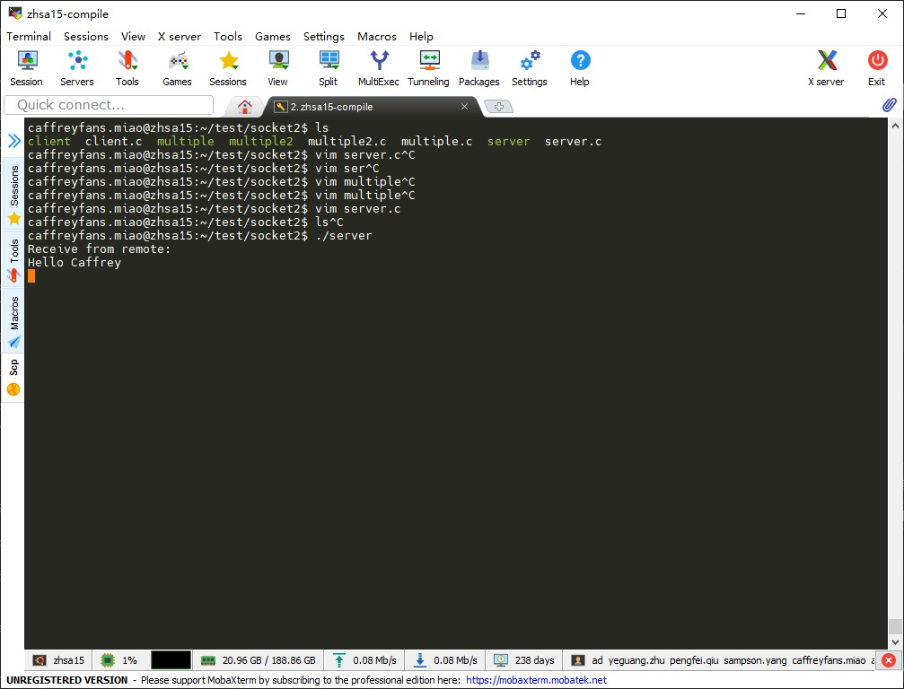

Linux 网络编程下地址占用问题

================================

自己写的一个 demo 程序遇到一个奇怪的问题是关于端口占用问题的，先看下源码。

.. code:: c

	#include <stdio.h>
	#include <stdlib.h>
	#include <unistd.h>
	#include <netdb.h>
	#include <netinet/in.h>
	#include <string.h>
	int main(int argc, char *argv[]) {
		int listenfd, connfd;
		char buffer[256];
		struct sockaddr_in serv_addr;
		char *str = "Receive your message --- server";
		
		/* Create socket */
		listenfd = socket(AF_INET, SOCK_STREAM, 0);
		if (listenfd < 0) {
			perror("ERROR opening socket");
			exit(1);
		}

		/* Initialize socket structure */
		bzero((char *)&serv_addr, sizeof(serv_addr));
		int flag;
		if (setsockopt(listenfd, SOL_SOCKET, SO_RESUEADDR, &flag, sizeof(flag))) {
			perror("Set socket option failed");
		}
		
		/* Now bind the host address using bind() call. */
		if (bind(listenfd, (struct sockaddr *)&serv_addr, sizeof(serv_addr)) < 0 ) {
			perror("ERROR on binding");
			exit(1);
		}
		listen(listenfd, 5);
		while (1) {
			connfd = accept(listenfd, (struct sockaddr*)NULL, NULL);
			bzero(buffer, sizeof(buffer));	
			int n = read(connfd, buffer, sizeof(buffer));
			if (n > 0) {
				printf("Receive from remote:\n%s\n", buffer);
			}
			write(connfd, str, strlen(str));
			close(connfd);	
		}
		return 0;
	}

程序是可以正常运行的，能从接收到客户端发过来的数据

捕获程序终止信号，主动关闭资源
---------------------------------

假如我们关闭程序就是用的 `Ctrl + c` 这种方式，那么这会产生一个 `SIGINT` 信号到程序，那我们就在捕获到信号后主动关闭我们的资源就行了所以我们程序就可以这样改：

.. code:: c
	
    #include <stdio.h>
	#include <stdlib.h>
	#include <unistd.h>
	#include <netdb.h>
	#include <netinet/in.h>
	#include <signal.h>
	#include <string.h>
	
	int listenfd = -1;
	void on_sigint(int signum) {
		if (listenfd > 0) {
			close(listenfd);
			listenfd = -1;
		}
		exit(0);
	}

	int main(int argc, char *argv[]) {
		signal(SIGINT, on_sigint);
    	int listenfd, connfd;
    	char buffer[256];
    	struct sockaddr_in serv_addr;
    	char *str = "Receive your message --- server";

    	/* Create socket */
    	listenfd = socket(AF_INET, SOCK_STREAM, 0);
    	if (listenfd < 0) {
    		perror("ERROR opening socket");
    		exit(1);
    	}

    	/* Initialize socket structure */
    	bzero((char *)&serv_addr, sizeof(serv_addr));
    	serv_addr.sin_family = AF_INET;
    	serv_addr.sin_addr.s_addr = htonl(INADDR_ANY);
    	serv_addr.sin_port = htons(5010);

    	/* Now bind the host address using bind() call. */
    	if (bind(listenfd, (struct sockaddr *)&serv_addr, sizeof(serv_addr)) < 0 ) {
    		perror("ERROR on binding");
    		exit(1);
    	}

    	listen(listenfd, 5);

    	while (1) {
    		connfd = accept(listenfd, (struct sockaddr*)NULL, NULL);
    		bzero(buffer, sizeof(buffer));	
    		int n = read(connfd, buffer, sizeof(buffer));
    		if (n > 0) {
    			printf("Receive from remote:\n%s\n", buffer);
    		}
    		write(connfd, str, strlen(str));
    	    	close(connfd);	
    	}
    	return 0;
	}

等待系统自动释放资源
------------------------

这种方式一般不可取，但是它可以帮助我们理解 tcp/ip 协议栈。不知道你注意到没有，example code 里面使用的是 SOCK_STREAM 类型，也就是 TCP 啦。我们先看一下 TCP 的状态图：

socket 资源是由协议栈分配的而不是我们的用户程序，所以就算我们用户程序退出了，socket 资源还是没释放。当用户程序退出了，server 端进入 TIME_WAIT 状态，这个状态会维持 2MLS 这个时间在 Linux 下我们是可以通过命令查看到的

.. code:: bash

	cat /proc/sys/net/ipv4/tcp_fin_timeout

也就是说，我们的用户程序在 2MLS 后就不会再报地址占用的问题了。