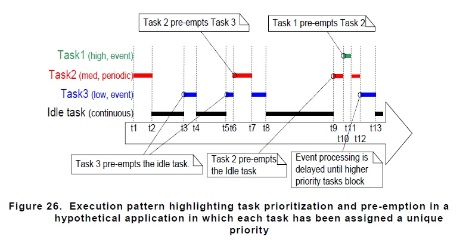

任务
==========

我们可以想象有这么一种情况，有这么一段代码在一直运行

.. code-block:: c

   void foo() {
      i++;
      printf("%d", i);
   }

   void loop() {
      foo();
   }

如何在前台系统里，那么这个 ``foo`` 函数就会一直运行。

好的现在我们需求变了，我们又有一段新的代码

.. code-block:: c

   void foo() {
      i++;
      printf("%d", i);
   }

   void foo2() {
      j++;
      printf("%d", j);
   }

   void loop() {
      foo();
      foo2();
   }

如果在前台系统，那就是 ``foo`` 与 ``foo2`` 交替运行。如何其中一个函数执行延时操作或者进入了死循环都会影响到另一个函数。那这样的话对于开发者就会考虑许多细节了，编程的时候需要考虑在这个大循环内所有函数彼此之间可能存在的影响。而且这种前台系统也存在另一个问题，有些时候我们可能会希望 ``foo2`` 不运行，但是在这里只到 PC 指针指到 ``foo2`` 了就肯定会运行。所以后面有提出了状态机，就像下面这样

.. code-block:: C

   void loop() {
      switch (state) {
         case 1:
            foo();
            break;
         case 2:
            foo2();
            break;
         default:
            break;
      }
   }

当满足某一条件时才执行相应的函数，然后执行到这些函数时，它又可能去改变状态机状态，到下一次循环的时间，上一次执行过的函数可能在这一次就不会执行了，而执行另一个函数了，这就是状态机大概的雏形。

后面人们又觉得状态机虽然好用，但是状态机它并不能实时的响应我们的任务，它必须在执行状态判断的时候，运行条件为真时才能执行到我们想要执行的代码段。如果说前台系统是一匹无法控制的野马，状态机也只是签了绳的野马，我们也不能对它任意使唤。

所以又有了现在的实时系统，而在这时候也有了任务的概念了。我们先想一下实时系统要解决的问题，对比上面提到的状态机，状态机有它的优点但是我们想让状态机立刻切换到我们马上要执行的代码段显然是不现实的，RTOS 就是来解决这个问题的。

我们先看看在 FreeRTOS 里来执行我们的两个函数该怎么写
   
.. code-block:: c

   void foo() {
   int i;
      while (1) {
         i++;
         printf("%d", i);
      }
   }

   void foo2() {
   int j;
      while (1) {
         j++;
         printf("%d", j);
      }
   }

   int main() {
      xTaskCreate(foo,           /* Function that implements the task. */
                  "foo",         /* Text name for the task. */
                  1024,          /* Stack size in words, not bytes. */
                  ( void * ) 1,  /* Priority at which the task is created. */
                  NULL);         /* Used to pass out the created thask's handle */

      xTaskCreate(foo2,           /* Function that implements the task. */
                  "foo2",         /* Text name for the task. */
                  1024,          /* Stack size in words, not bytes. */
                  ( void * ) 1,  /* Priority at which the task is created. */
                  NULL);         /* Used to pass out the created thask's handle */
   }

这里并不对相关 API 如何使用进行说明，主要想说明任务的这个概念。我们的想法还是 CPU 能执行 ``foo`` 和 ``foo2`` 里面的代码段，但是在 RTOS 里，它会把我们想要执行的代码段封装成了“任务”，为什么要这样封装，直接执行不好吗？解释这个问题我们需要简单了解下 RTOS 的实现原理。

我们都知道中断比普通用户函数优先级高，中断来了能被硬件第一时间检测到。MCU 里面有个叫“晶振”的东西，它能定时稳定的产生脉冲信号，就能给 RTOS 提供稳定的时钟信号。在 FreeRTOS 里就能检测到这个 Systick 中断，FreeRTOS 里通过 configTICK_RATE_HZ 来确定一次 Systick 中断产生的间隔。比如 configTICK_RATE_HZ = 1000，那么就是 1ms 生成一次 Systick 中断。FreeRTOS 每一次 Systick 中断就会在其 ISR 里面执行任务的调度算法。FreeRTOS 一般常用的调度算法是 抢占式分时算法，抢占式就是有优先级的概念，分时就是有时间片的概念

